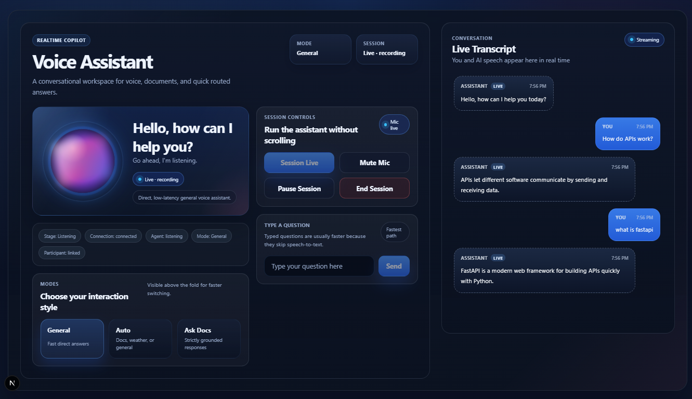
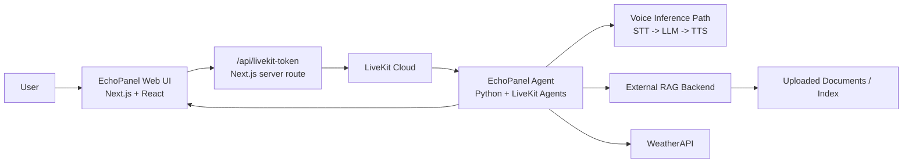
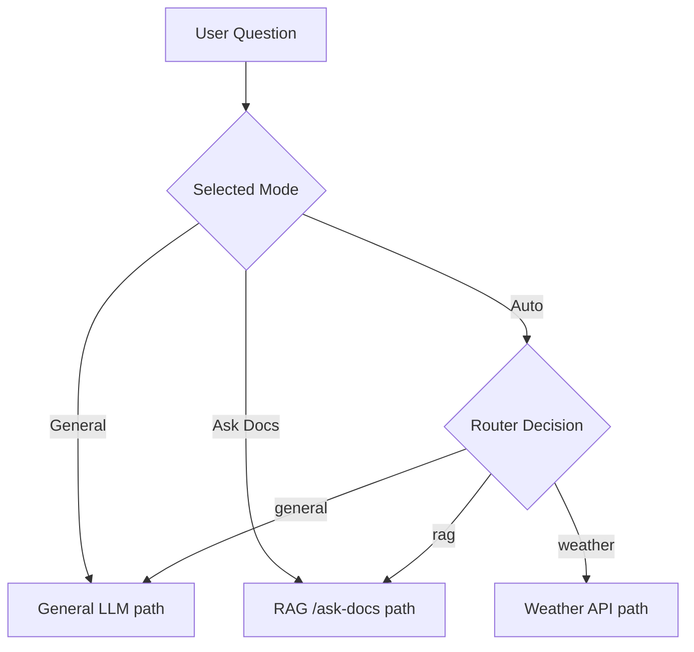

# EchoPanel

[](https://github.com/)
[](https://nextjs.org/)
[](https://docs.livekit.io/agents/)
[](https://livekit.io/)
[](#api--service-integrations)
[](https://www.typescriptlang.org/)
[](https://www.python.org/)
[](#license)

EchoPanel is a real-time AI voice assistant dashboard built around LiveKit. It combines browser-based voice interaction, live transcript streaming, typed fallback input, optional document-grounded Q&A through an external RAG backend, weather/tool routing, and a modern desktop-first control panel for demos and rapid testing.

## Project Preview

Place your screenshot at `assets/project-preview.png`.



## Demo GIF

If you want an animated demo, place it at `assets/demo.gif`.


## Features

- Real-time AI voice assistant powered by LiveKit
- Live transcript for both the user and assistant
- Start, pause, mute/unmute, and end session controls
- Typed question support alongside voice interaction
- `Ask Docs` mode for document-grounded Q&A
- Document upload flow through the frontend
- `Auto` mode with route selection for general chat, RAG, and weather
- Weather API integration for location-based questions
- Desktop-first dark dashboard UI with transcript and controls visible above the fold

## Tech Stack

### Frontend

- Next.js 15
- React 19
- TypeScript
- Custom CSS in `apps/web/app/globals.css`
- LiveKit client SDK

### Backend / Agent

- Python 3.12
- LiveKit Agents SDK
- `python-dotenv`
- Silero VAD / LiveKit agent plugins

### Voice / Inference

- LiveKit Cloud
- Speech-to-text, LLM, and TTS routed through the LiveKit agent pipeline

### External Services

- Optional external RAG/document service
- Optional WeatherAPI integration

## Architecture

### System diagram



### Voice flow

`Speech -> LiveKit -> Agent -> STT/LLM/TTS -> Spoken response + transcript`

### Typed flow

`Typed input -> Agent -> LLM or routed tool path -> Spoken response + transcript`

### Ask Docs flow

`Upload file -> frontend RAG proxy -> external RAG backend -> indexed documents -> Ask Docs query -> grounded answer`

### Mode routing diagram



## Installation

### Prerequisites

- Node.js 20+
- npm 10+
- Python 3.12 recommended
- A LiveKit Cloud project
- Optional external RAG backend if you want document Q&A
- Optional WeatherAPI key if you want weather routing

### 1. Clone the repository

```bash
git clone <your-repo-url>
cd EchoPanel
```

### 2. Configure environment variables

Create local env files from the placeholders:

- Root reference: `.env.example`
- Frontend env: `apps/web/.env.local`
- Agent env: `apps/agent/.env`

Do not commit real `.env` files or secrets.

### 3. Install frontend dependencies

```powershell
cd C:\Users\affan.khan\Desktop\EchoPanel\apps\web
npm install
```

### 4. Install agent dependencies

```powershell
cd C:\Users\affan.khan\Desktop\EchoPanel\apps\agent
python -m venv .venv312
.\.venv312\Scripts\Activate.ps1
pip install -r requirements.txt
python src/agent.py download-files
```

### 5. Run the frontend

```powershell
cd C:\Users\affan.khan\Desktop\EchoPanel\apps\web
npm run dev
```

Open [http://localhost:3000](http://localhost:3000).

### 6. Run the agent locally (optional)

```powershell
cd C:\Users\affan.khan\Desktop\EchoPanel\apps\agent
.\.venv312\Scripts\Activate.ps1
python src/agent.py start
```

If you are using a deployed LiveKit Cloud agent instead, you only need the frontend running locally.

## Environment Variables

Use placeholder values only in committed files. Keep real credentials local.

Reference from [.env.example](C:/Users/affan.khan/Desktop/EchoPanel/.env.example):

```ini
LIVEKIT_URL=wss://your-project.livekit.cloud
NEXT_PUBLIC_LIVEKIT_URL=wss://your-project.livekit.cloud
LIVEKIT_API_KEY=your_livekit_api_key
LIVEKIT_API_SECRET=your_livekit_api_secret
RAG_API_URL=https://your-rag-service.example.com
RAG_API_KEY=your_rag_api_key
WEATHER_API_KEY=your_weatherapi_key
WEATHER_API_BASE_URL=https://api.weatherapi.com/v1
```

### Recommended placement

| Variable | Used by | Notes |
| --- | --- | --- |
| `LIVEKIT_URL` | frontend server route + agent | LiveKit Cloud URL |
| `NEXT_PUBLIC_LIVEKIT_URL` | frontend client | Client WebSocket URL |
| `LIVEKIT_API_KEY` | frontend server route + agent | LiveKit API key |
| `LIVEKIT_API_SECRET` | frontend server route + agent | LiveKit API secret |
| `RAG_API_URL` | frontend RAG proxy + agent | External document service base URL |
| `RAG_API_KEY` | frontend RAG proxy + agent | Shared API key for the RAG service |
| `WEATHER_API_KEY` | agent | Used for weather questions in `Auto` mode |
| `WEATHER_API_BASE_URL` | agent | Optional override, defaults to WeatherAPI |

## Usage

### Frontend only with cloud agent

1. Start the web app with `npm run dev`.
2. Open [http://localhost:3000](http://localhost:3000).
3. Click `Start Session`.
4. Speak or type a question.
5. Watch the live transcript update in the right panel.

### Local development with local agent

1. Start the frontend.
2. Start the Python agent locally.
3. Open the app and begin a session.
4. Test voice, typed questions, and transcript behavior.

### Document Q&A

1. Switch to `Ask Docs`.
2. Upload a supported file.
3. Wait until the document service reports readiness.
4. Ask a grounded question about the uploaded content.

### Auto mode

1. Switch to `Auto`.
2. Ask:
   - a general question for the normal LLM path
   - a document question for the RAG path
   - a weather question for the weather service

## Folder Structure

```text
EchoPanel/
├─ apps/
│  ├─ agent/
│  │  ├─ src/
│  │  │  ├─ agent.py
│  │  │  └─ prompts.py
│  │  ├─ Dockerfile
│  │  ├─ livekit.toml
│  │  └─ requirements.txt
│  └─ web/
│     ├─ app/
│     │  ├─ api/
│     │  ├─ globals.css
│     │  └─ page.tsx
│     ├─ components/
│     │  ├─ assistant-shell.tsx
│     │  └─ voice-assistant-panel.tsx
│     ├─ lib/
│     └─ package.json
├─ assets/
├─ .env.example
└─ README.md
```

## API & Service Integrations

### Frontend API routes in this repository

| Method | Route | Purpose |
| --- | --- | --- |
| `POST` | `/api/livekit-token` | Creates a room token and dispatches the LiveKit agent |
| `GET` | `/api/rag/health` | Checks the external RAG service availability |
| `POST` | `/api/rag/upload` | Uploads documents to the external RAG backend |

### External services expected by the app

#### RAG service

Expected external endpoints used by EchoPanel:

- `GET /health`
- `POST /upload`
- `POST /ask-docs`

#### Weather service

The agent uses WeatherAPI through `WEATHER_API_KEY` and `WEATHER_API_BASE_URL`.

## Screenshots / GIF Instructions

### To add a screenshot

1. Create or use the `assets/` folder.
2. Save your screenshot as `project-preview.png`.
3. Put it inside `assets/`.
4. Use:

```md

```

### To add a GIF

1. Save the GIF as `demo.gif`.
2. Put it inside `assets/`.
3. Use:

```md

```

## Notes

- This repository contains the EchoPanel frontend and LiveKit agent, not the full RAG backend implementation.
- The RAG backend is expected to run as a separate service and be reachable through `RAG_API_URL`.
- The dashboard is optimized primarily for desktop and laptop usage.

## License

License not specified.
